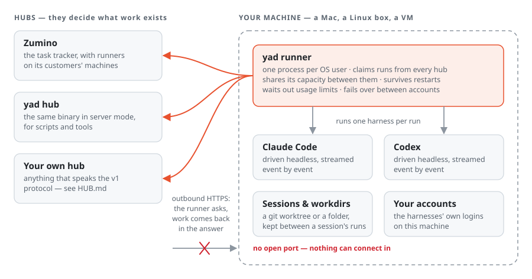
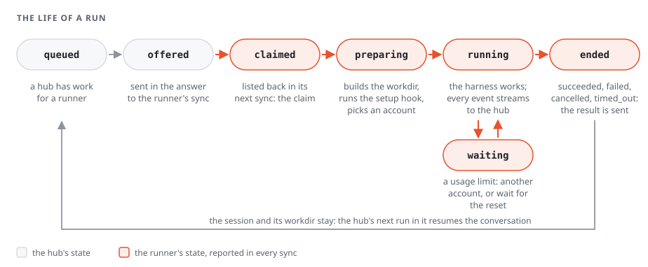

<p align="center">
  
</p>

<p align="center">
  <b>Run coding-agent harnesses on machines you own — for any hub.</b>
</p>

<p align="center">
  <a href="https://github.com/skkap/yad/actions/workflows/ci.yml"></a>
  <a href="https://github.com/skkap/yad/releases"></a>
  <a href="https://pkg.go.dev/github.com/skkap/yad"></a>
  <a href="LICENSE"></a>
</p>

YAD is one small binary for a Mac or a Linux box. It notices which coding-agent
harnesses are installed — Claude Code, Codex — and connects **out** to one or
more **hubs**: the systems that decide what work exists. When a hub has work,
YAD claims a run, prepares a working directory, drives the harness in a session
it keeps on disk, streams everything that happens, and reports how it ended.

It survives restarts and usage limits, fails over between your accounts, and
never opens a port.

## Why YAD

YAD is for work you want a coding agent to do unattended: your own software
hands out the task, and a machine you prepared for it does the work and
reports back.

- **Work comes from your own projects.** Add the hub side of the protocol to
  anything that needs tasks run — a tracker, a bot, a pipeline, an internal
  service — and it can hand work to runners. [HUB.md](HUB.md) is the whole
  contract, and `yad hub` is a ready-made hub if you would rather not build one.
- **It runs in an environment you prepared.** A runner lives on a machine you
  set up for the job: a VM or a remote box with the tools, repositories, data
  access and credentials that work needs, and nothing it does not.
  [`machines/`](machines/README.md) builds such a machine from a spec you keep
  in a repository, and [docs/containers.md](docs/containers.md) does the same
  with a container.
- **Not tied to one harness or one account.** A run says which harness it
  wants — Claude Code or Codex today — and a runner can hold several accounts
  for each, moving to the next when one hits its usage limit.
- **Control stays with the machine's owner.** Runners connect out and never
  listen, and what a harness may do on a machine is decided there, never by a
  hub. [docs/run-it-safely.md](docs/run-it-safely.md) says where the edges are.

## How it works

<p align="center">
  
</p>

- **A hub** is anything that serves the runner protocol: [Zumino](https://zumino.cc),
  the task tracker; `yad hub`, the same binary in server mode; or your own —
  [HUB.md](HUB.md) is the whole contract.
- **The runner** is `yad`, running as you. Every 5 to 60 seconds, as each hub
  asks, it tells the hub what it holds, and the hub's answer carries the runs it
  offers. It serves any number of hubs at once and shares its capacity fairly
  between them. Nothing ever connects to it.
- **A harness** is the coding agent itself. YAD drives it headless with the
  logins already on the machine — it keeps no harness token of its own — in a
  **session** whose workdir, a git worktree or a folder, is kept between runs.
  The hub's next run in that session continues the same conversation.

## The life of a run

<p align="center">
  
</p>

A hub queues a run and offers it in its answer to the runner's next sync. The
runner claims it by listing it back, builds the workdir, runs the repository's
own [setup hook](docs/setup-hooks.md), starts the harness and streams every
event as it happens. When an account hits its usage limit the run waits — for
another of your accounts, or for the reset — rather than failing. How it ended,
and the tokens it used, go back in the result.

## What you get

- **Many hubs, one runner.** Fair shares of the machine's capacity between
  hubs, with a cap per harness.
- **Nothing lost to a restart.** Sessions, events not yet delivered and results
  not yet acknowledged live in SQLite. A restarted runner delivers them first
  and reports the runs it was holding when it died.
- **Your accounts, used well.** Several logins per harness: a run takes the one
  whose usage window refills soonest, and moves to another when it runs out.
- **Secrets that do not linger.** A hub can hand one run a short-lived secret.
  It reaches that harness process alone and is deleted when the run ends.
- **A plain report of the machine.** `yad doctor` lists every harness it knows,
  installed or not, and says which it can drive.
- **A protocol you can check.** The OpenAPI documents are generated from the Go
  types, and `yad conformance` tests any hub against them.

```
$ yad doctor
HARNESS             STATUS      VERSION                PATH
Claude Code         ready       2.1.278                /Users/me/.local/bin/claude
Codex               ready       0.147.0                /Users/me/.local/bin/codex
Gemini CLI          no adapter  0.29.2                 /…/bin/gemini
GitHub Copilot CLI  —
OpenCode            —
Cursor Agent        no adapter  2025.09.12-4852336     /Users/me/.local/bin/cursor-agent

profile default — config /Users/me/.config/yad
2 harness(es) this runner can be given work for.
```

## What it is not

YAD is not a tracker, a UI, an orchestrator or a scheduler: a hub decides what
work exists and when, and YAD runs what it is given.

**And it is not a sandbox.** It runs the harness as you, with whatever you can
reach, and turns the harness's own permission prompts off, because nobody is
there to answer them. Whoever sets YAD up decides what access its harnesses get:

- Give it a machine, VM or container you would let an unknown repository run
  code on — never a laptop holding credentials you care about.
- Run one runner per trust domain: personal and work are two runners, ideally
  two OS users. [`machines/`](machines/README.md) builds one Lima VM per runner
  from a spec you keep in a repository.
- Connect only hubs you trust. A hub writes the brief, and a brief can ask the
  harness for anything the machine allows
  ([0038](docs/decisions/0038-the-owner-trusts-the-hubs-it-connects.md)).
- What a harness may do — Claude's permission mode, Codex's sandbox — is your
  configuration in `config.toml`, and no hub can change it.

**[docs/run-it-safely.md](docs/run-it-safely.md)** is the full guide.

## Where to run it

Give a runner a machine of its own, holding the tools and access its work
needs and nothing it does not:

- **A VM.** [`machines/`](machines/README.md) builds one Lima VM per runner
  from a spec you keep in a repository — its size, tools, harnesses and home
  files — with the runner's user shut out of the host, the LAN and the
  tailnet. It is the strongest boundary, and the one for hubs that are not
  fully yours.
- **A container.** [docs/containers.md](docs/containers.md) is a tested Docker
  recipe: one image with yad and its harnesses, and one volume that holds the
  runner's identity, its hub credentials and its logins.
- **A server you already trust**, as an OS user of its own, kept running by
  `yad service install`.

**Logging in.** Each harness account is logged in once, on the machine:
`yad account add claude main --token -` with a token from `claude setup-token`,
made on any computer with a browser, or `yad account add codex main --device`
with a code entered anywhere. Add more accounts under other labels and the
runner uses them in turn.

When the machine has no convenient shell — a VM, a container, a box somewhere
else — **the hub can do it instead**, if it supports it. It shows **Log in**
beside an account the runner reports as needing one: follow the link and
paste the code back, or paste a token, and the login lands on the runner
without anyone opening a terminal there
([0055](docs/decisions/0055-a-hub-may-log-an-account-in-by-link-or-by-token.md)).
Claude logs in this way today; Codex logs in on the machine.

## Install

```bash
curl -fsSL https://raw.githubusercontent.com/skkap/yad/master/scripts/install.sh -o yad-install.sh &&
  sh yad-install.sh
yad doctor
```

The script needs no login. It puts `yad` in `~/.local/bin` and checks the
release's SHA-256 before writing anything. Each harness is installed and logged
in on its own first — `claude`, `codex` — because YAD uses their logins.

Or build it from source with Go 1.27: `git clone https://github.com/skkap/yad &&
cd yad && make install`. Pinning a version, upgrading with `yad upgrade`,
forks, and checking a download by hand are in
**[docs/install.md](docs/install.md)**.

## Try it: a hub, a runner and one run

Everything on one machine, on loopback. It uses your `default` profile and
spends one short Claude Code turn on the cheapest model, so `claude` must be
installed and logged in (`yad doctor` says `ready`).

In one terminal, the hub — it serves on `127.0.0.1:7878` and prints the
commands that act on it:

```bash
yad hub serve
```

In another:

```bash
yad hub admin-token create                  # lets yad hub submit and watch talk to the hub
yad hub token create |
  yad connect http://127.0.0.1:7878/v1 --token - --name local
yad daemon start                            # the runner, in the background
yad hub submit --harness claude --model haiku --watch "Reply with exactly: pong"
```

The registration token goes through the pipe, never through your terminal or
argv. `submit --watch` prints the run as it moves — `queued`, `offered`,
`claimed`, the harness's words, `succeeded` — and exits 0 when the run
succeeds. For Codex, `--harness codex` with a Codex model. `yad status` shows
the runner, `yad hub runners` the hub's view of it.

Then stop both: `yad daemon stop`, and Ctrl-C the hub. The state is in
`~/.config/yad` and `~/.local/share/yad` — the runner's identity, its
credential for this hub, the hub's database. To run YAD for real on one
machine — as a service, in a profile of its own, and removed cleanly
afterwards — follow [docs/trial.md](docs/trial.md).

## Run it as a service

```bash
yad service install     # launchd agent on macOS, systemd user unit on Linux
yad service status
yad service uninstall
```

It runs as you, never as root, restarts after a crash, and drains on stop: no
new runs, and the ones it holds get time to finish. Details, and what to re-run
after an upgrade, are in [docs/install.md](docs/install.md#run-it-as-a-service).

## Status

Everything above works today. **No release has been tagged yet**, so until the
first one the install script has nothing to fetch — build from source.

Not built yet: `yad disconnect`, so a runner cannot yet leave a hub on its own;
live sessions, which would keep one harness process across runs (reserved in
the protocol); and adapters for Gemini CLI, GitHub Copilot CLI, OpenCode and
Cursor Agent, which `yad doctor` recognises but will not run.

## Documentation

| | |
|---|---|
| **[docs/install.md](docs/install.md)** | installing, pinning, upgrading, forks, and running as a service |
| **[docs/run-it-safely.md](docs/run-it-safely.md)** | what a run can do on the machine you give it, and how to limit that |
| **[machines/README.md](machines/README.md)** | building a VM for one runner from a spec, and logging it in — at the machine or from the hub |
| **[docs/containers.md](docs/containers.md)** | running a runner in a Docker container: the image, the volume, connecting, logging in, upgrading |
| **[docs/trial.md](docs/trial.md)** | running YAD for real on one machine, and removing it cleanly |
| **[docs/setup-hooks.md](docs/setup-hooks.md)** | making a repository ready for a run: `.worktree/setup` and the `WT_*` variables |
| **[HUB.md](HUB.md)** | building a hub: every call, the run state machine, leases, sessions, grants, errors, and `yad conformance` |
| **[DOMAIN.md](DOMAIN.md)** | the vocabulary: runner, hub, harness, session, run, account, grant, sync |
| **[ARCHITECTURE.md](ARCHITECTURE.md)** | the shape: packages, the protocol, how each harness is driven, local state |
| **[docs/decisions/](docs/decisions/)** | why each hard-to-reverse choice was made |

## Contributing

Issues and pull requests are welcome — [CONTRIBUTING.md](CONTRIBUTING.md) says
how the code is written and what `make check` runs. Report a vulnerability
privately, as [SECURITY.md](SECURITY.md) describes, never in an issue.

## Prior art

Read before adding anything; most of this problem is solved somewhere.

| | What it is |
|---|---|
| **Anthropic self-hosted runners** | The official version of this idea for Claude, and the source of *runner*, *lease* and *release*: outbound polling, the poll is the heartbeat, drain and retire-at |
| **[Multica](https://github.com/multica-ai/multica)** | The closest complete implementation: a daemon that detects CLIs, claims tasks and drives Claude and Codex. Read for shapes only — its licence restricts derived code ([0014](docs/decisions/0014-multica-shapes-never-code.md)) |
| **GitHub Actions, Buildkite and GitLab runners** | Registration-token exchange, leases, idempotent results, chunked logs, cancel on the channel already polled |
| **Paseo, vibe-kanban, happy** | The adapter split this repo follows: Claude by stream-json, Codex by app-server, ACP for the long tail |
| **ACP** (Agent Client Protocol) | The likely answer for the recognised harnesses; not for Claude or Codex, which speak it only through Node adapters |
| **Coder agentapi** | TUI scraping behind HTTP; archived in September 2026. The approach this repo does not take |

## License

[MIT](LICENSE). Release binaries carry the notices of everything compiled into
them in `THIRD_PARTY_LICENSES.txt`.

## The name

YAD. That is all it is.
